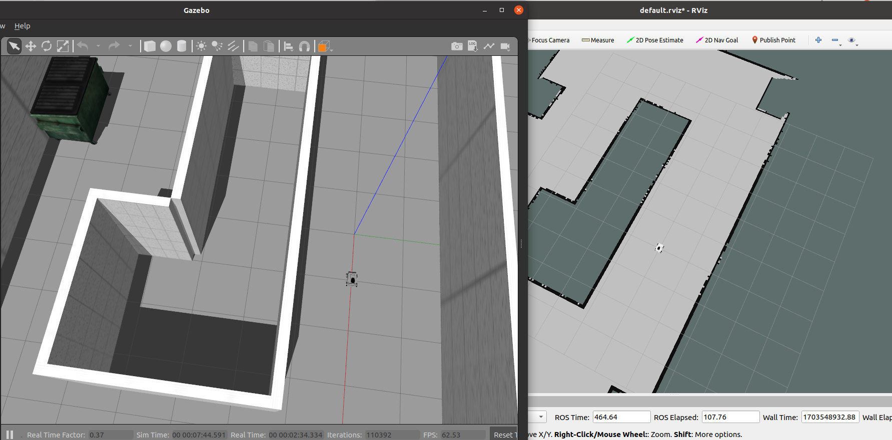

# Fritzrobot_description

## Description
Model files
##

### 2023-12-26 update
modified the models in gazebo and rviz, fixed the issue of the joint_state_publisher through changed python to v3.8

### 2023-12-22 update

modified the models based on wheeltec's models. 

changed the types of wheel_shaft_joints and wheel_roll_joints because the joint_state_pulisher can't start(don't know why), so that the continous joint can't be transformed. 
